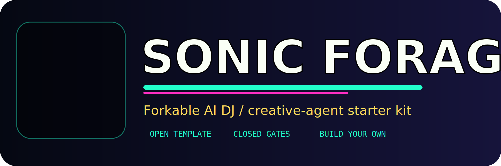

<p align="center">
  
</p>

<p align="center">
  <strong>Fork the signal. Build your own intergalactic DJ / creative-agent cockpit.</strong>
</p>

# SonicForge Starter Kit

Forkable starter kit for building your own AI DJ / radio host / creative-agent command center.

This repo is the clean starter shape of the SonicForge workbench: a FastAPI launch cockpit, safe backend contracts, ComfyUI workflow lane placeholders, timeline-first DJ show engine patterns, and a payload template for creating your own performer/agent.

Generated: `2026-05-03T02:56:12Z`

## What you can create

- Your own AI DJ / intergalactic radio host / festival performer.
- A launch cockpit with read-only status cards and closed safety gates.
- A timeline-first show engine that mixes cached voices + generated tracks without needing GPU power during playback.
- A creator payload pack: persona, safety boundaries, workflow bindings, setup docs, and verification scripts.

## Closed by default

The starter kit does **not** start GPU jobs, train models, upload private media, post publicly, or call paid APIs unless you explicitly wire your own secrets and flip local approval gates.

Default gates live in `.env.example`:

```text
ALLOW_GPU=0
ALLOW_PAID_API=0
ALLOW_PUBLIC_POSTING=0
ALLOW_PRIVATE_UPLOAD=0
ALLOW_TRAINING=0
ALLOW_WORKFLOW_PROMPT=0
```

## Quick start

```bash
python3 -m venv .venv
. .venv/bin/activate
pip install -r requirements.txt
cp .env.example .env
python3 scripts/verify_starter_kit.py
python3 -m uvicorn server.main:app --host 127.0.0.1 --port 8799
```

Open:

- `http://127.0.0.1:8799/launch`
- `http://127.0.0.1:8799/setup`

## Create your own

Read these first:

- `docs/start-here/CREATE_YOUR_OWN_SONICFORGE.md`
- `docs/setup/FORK_AND_DEPLOY_GUIDE.md`
- `docs/safety/SAFETY_BOUNDARIES.md`
- `docs/swarm/SWARM_NIGHT_OPERATING_MODEL.md`
- `payloads/sonicforge-creator-template/PAYLOAD.md`

## Repository roles

- `server/` - local FastAPI app and status APIs.
- `app/static/` - launch cockpit/static frontend.
- `scripts/` - verification, safe generation/mix runners, and starter-kit checks.
- `workflows/` - sanitized workflow JSON/cards; endpoints are supplied by env, never committed.
- `payloads/` - cloneable creator/agent payload templates.
- `docs/` - operator guides, safety boundaries, setup, and architecture notes.

## Secret policy

Never commit `.env`, real credentials, private endpoints, SSH private keys, private media, or model weights unless intentionally licensed and published.

Run before sharing:

```bash
python3 scripts/verify_starter_kit.py
```
